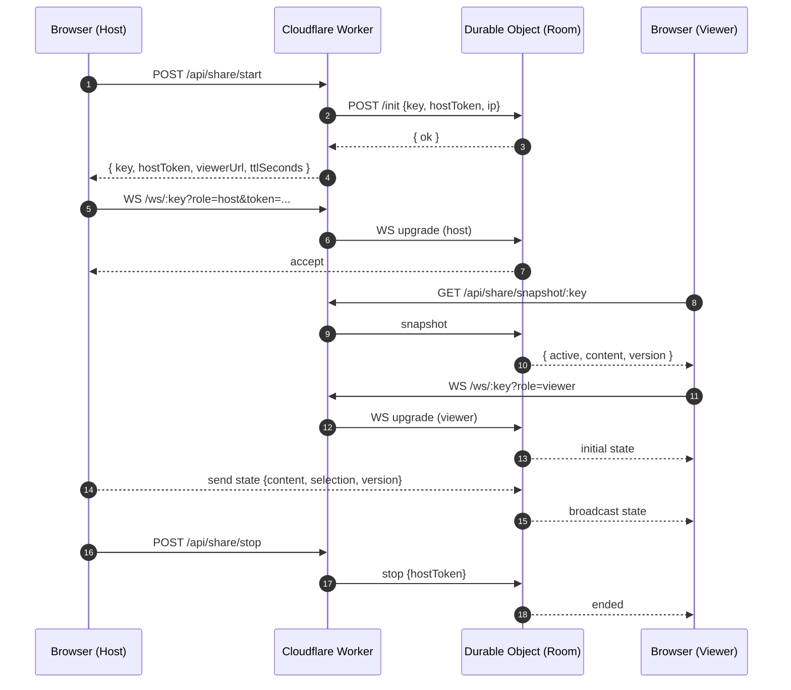

# Offline Code Editor + Live Share 🚀

A lightweight, browser-based code editor that works completely offline — with an optional Live Share feature powered by a tiny Cloudflare Worker.

## ✨ What it does

- **Syntax highlighting** for 18+ languages (JavaScript, Python, CSS, HTML, and more)
- **Code formatting** with one click
- **Multiple themes** (dark, light, high contrast)
- **Drag & drop files** to open them instantly
- **Zero network requests** for the editor — everything runs locally in your browser
- **Optional Live Share**: broadcast your editor state to viewers in real time (read-only for viewers)

## 🎯 Perfect for

- Quick code snippets and prototyping
- Viewing/editing files when you're offline
- Teaching code without complex IDE setup
- Sharing a read-only view of your editor during demos or calls

## 🚀 Try it live

- App: **[editor.sanjaysingh.net](https://editor.sanjaysingh.net)**

## 🛠️ Tech Stack

- Vanilla JavaScript (no frameworks!)
- Monaco Editor (the same engine that powers VS Code)
- Pure CSS for styling
- Cloudflare Workers + Durable Objects (for Live Share)
- GitHub Actions for auto-deployment

## 📝 Usage (Editor)

1. Open the editor in your browser
2. Drag & drop a file or use the open button
3. Select your language from the dropdown
4. Start coding

---

## Live Share

### Overview
- Host starts a session to generate a short key like `ABC-234` and a sharable URL
- Viewers join with the key or open the URL; their editor becomes read-only
- Host’s content updates are broadcast live to all viewers via WebSockets
- Host can stop the session at any time (viewers see “Session ended”)

### How it works


### UI Quickstart
- Start: click the signal icon to start Live Share; copy the link from the dialog
- Join: click the link or use the link icon and enter the key (format `ABC-234`)
- Stop: host clicks the stop icon

---

## Live Share Server (Cloudflare Worker)

This repo includes a Cloudflare Worker and a Durable Object that power Live Share (in `server/`).

### Prerequisites
- Node 18+
- Cloudflare `wrangler` CLI installed: `npm i -g wrangler`
- A Cloudflare account with Durable Objects enabled

### Configure
Edit `server/wrangler.toml` as needed:
- `ALLOWED_ORIGINS`: comma-separated site origins allowed to call the APIs and open WebSockets (e.g., `http://localhost:8080`)
- `TURNSTILE_SECRET_KEY` (optional): set to enable Cloudflare Turnstile verification when creating sessions
- `ROOM_TTL_SECONDS`, `MAX_VIEWERS`, `CREATE_LIMIT_PER_HOUR`: operational limits

### Run locally
1) Start the Worker

```sh
cd server
wrangler dev
```

2) Serve the static client (`client/`) on another port, e.g. 8080

```sh
# from repo root
npx http-server client -p 8080 -c-1
```

3) Point the client at your Worker origin (if not same-origin). In `client/index.html` set:

```html
<meta name="live-share-base" content="http://127.0.0.1:8787">
```

Alternatively, you can set a global before loading `client/live-share.js`:

```html
<script>window.LIVE_SHARE_BASE = 'http://127.0.0.1:8787';</script>
```

### Deploy
```sh
cd server
wrangler deploy
```
- Bind the Durable Object namespace in Cloudflare if prompted (Wrangler migrations included)
- Set production site origin(s) in `ALLOWED_ORIGINS`

### API Summary
- `POST /api/share/start` → `{ key, hostToken, viewerUrl, ttlSeconds }`
- `POST /api/share/stop` with `{ key, hostToken }` → `{ ok: true }`
- `GET /api/share/snapshot/:key` → `{ active, content, selection, version }`
- `WS /ws/:key?role=host&token=...` or `WS /ws/:key?role=viewer`

### Security & Notes
- CORS and WebSocket Origin are enforced via `ALLOWED_ORIGINS`
- Optional Turnstile validation can be enabled with `TURNSTILE_SECRET_KEY`
- Sessions are time-bound via `ROOM_TTL_SECONDS`; `MAX_VIEWERS` limits viewers per room
- The editor intentionally blocks network APIs by default; the Live Share script restores `fetch`/`WebSocket` safely for its own use

---

## Contributing
- PRs welcome! Keep the code lightweight and dependency-free
- For Live Share changes, please test both the client and Worker locally

## License
MIT

